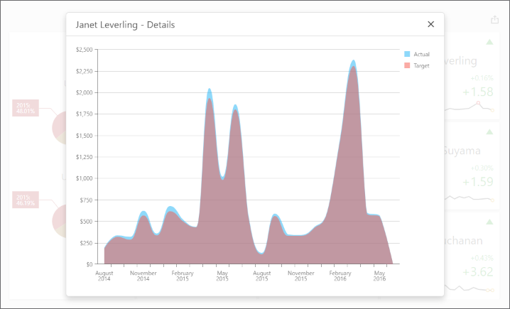

<!-- default badges list -->

<!-- default badges end -->
# Dashboard for Web Forms - How to obtain a dashboard item's client data

<!-- run online -->
**[[Run Online]](https://codecentral.devexpress.com/128580304/)**
<!-- run online end -->

The following example uses the DashboardControl's [client-side API](https://docs.devexpress.com/Dashboard/116302/web-dashboard/aspnet-web-forms-dashboard-control/client-side-api-overview) to obtain client data that corresponds to a particular visual element. When you click a card, the [dxChart](https://js.devexpress.com/DevExtreme/ApiReference/UI_Components/dxChart/) displays the detailed chart and shows a variation of actual/target values over time.

The [ViewerApiExtensionOptions.onItemClick](https://docs.devexpress.com/Dashboard/js-DevExpress.Dashboard.ViewerApiExtensionOptions#js_devexpress_dashboard_viewerapiextensionoptions_onitemclick) event is handled to obtain client data and invoke the [dxPopup](https://js.devexpress.com/DevExtreme/ApiReference/UI_Components/dxPopup/) component with the `dxChart`.

In the event handler, the [e.getData](https://docs.devexpress.com/Dashboard/js-DevExpress.Dashboard.ItemClickEventArgs#js_devexpress_dashboard_itemclickeventargs_getdata) method call obtains dashboard item's client data. The [e.getAxisPoint](https://docs.devexpress.com/Dashboard/js-DevExpress.Dashboard.ItemClickEventArgs#js_devexpress_dashboard_itemclickeventargs_getaxispoint) method returns the axis point corresponding to the clicked card while the [ItemData.getSlice](https://docs.devexpress.com/Dashboard/js-DevExpress.Dashboard.Data.ItemData?p=netframework#js_devexpress_dashboard_data_itemdata_getslice_value_) method returns the slice of client data by this axis point.

The [ItemDataAxis.getPoints](https://docs.devexpress.com/Dashboard/js-DevExpress.Dashboard.Data.ItemDataAxis?p=netframework#js_devexpress_dashboard_data_itemdataaxis_getpoints) method is used to obtain axis points that belongs to the "Sparkline" data axis. Corresponding actual/target values are obtained using the [ItemData.getDeltaValue](https://docs.devexpress.com/Dashboard/js-DevExpress.Dashboard.Data.ItemData?p=netframework#js_devexpress_dashboard_data_itemdata_getdeltavalue_deltaid_) method.

<!-- default file list -->
## Files to Look at

* [Default.aspx](./CS/ASPxDashboard_ClientData/Default.aspx) (VB: [Default.aspx](./VB/ASPxDashboard_ClientData/Default.aspx))
* [ClientData.js](./CS/ASPxDashboard_ClientData/Scripts/ClientData.js) (VB: [ClientData.js](./VB/ASPxDashboard_ClientData/Scripts/ClientData.js))
<!-- default file list end -->

## Documentation

- [ASP.NET Web Forms Dashboard Control - Client-Side API Overview](https://docs.devexpress.com/Dashboard/116302/web-dashboard/aspnet-web-forms-dashboard-control/client-side-api-overview)

## More Examples

- [Dashboard for Web Forms - How to get data from a clicked dashboard item](https://github.com/DevExpress-Examples/Web-Dashboard---How-to-get-data-from-a-clicked-dashboard-item)
- [Dashboard for Web Forms - How to obtain a dashboard item's underlying data for a clicked visual element](https://github.com/DevExpress-Examples/aspxdashboard-how-to-obtain-a-dashboard-items-underlying-data-for-a-clicked-visual-element-t492257)
- [Dashboard for Web Forms - How to obtain underlying data for the specified dashboard item](https://github.com/DevExpress-Examples/aspxdashboard-how-to-obtain-underlying-data-for-the-specified-dashboard-item-t518504)
- [Dashboard for ASP.NET Core - How to obtain a dashboard item's client data](https://github.com/DevExpress-Examples/asp-net-core-dashboard-get-client-data)
- [Dashboard for ASP.NET Core  - How to obtain a dashboard item's underlying data for a clicked visual element](https://github.com/DevExpress-Examples/asp-net-core-dashboard-get-underlying-data-for-clicked-item)
- [Dashboard for ASP.NET Core  - How to obtain underlying data for the specified dashboard item](https://github.com/DevExpress-Examples/asp-net-core-dashboard-display-item-underlying-data)
